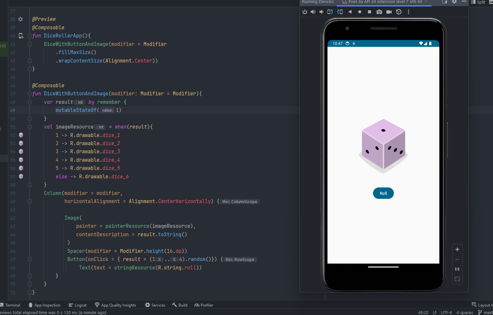

# Dice Roller App

Esta es una aplicación simple de dados que muestra una imagen de un dado y permite al usuario lanzar el dado al presionar un botón.

## Captura de pantalla



## Cómo funciona

La aplicación está escrita en Kotlin y utiliza Jetpack Compose para crear la interfaz de usuario. El código principal se encuentra en `MainActivity.kt`.

El corazón de la aplicación es la función `DiceWithButtonAndImage` que muestra la imagen del dado y el botón de lanzamiento. Al presionar el botón, se genera un número aleatorio del 1 al 6, que representa la cara del dado. Luego, la imagen del dado se actualiza según el número generado.

```kotlin
@Composable
fun DiceWithButtonAndImage(modifier: Modifier = Modifier){
    var result by remember {
        mutableStateOf(1)
    }
    val imageResource = when(result){
        1 -> R.drawable.dice_1
        2 -> R.drawable.dice_2
        3 -> R.drawable.dice_3
        4 -> R.drawable.dice_4
        5 -> R.drawable.dice_5
        else -> R.drawable.dice_6
    }
    Column(modifier = modifier,
           horizontalAlignment = Alignment.CenterHorizontally) {

           Image(
               painter = painterResource(imageResource),
               contentDescription = result.toString()
            )
            Spacer(modifier = Modifier.height(16.dp))
            Button(onClick = { result = (1..6).random()}) {
                Text(text = stringResource(R.string.roll))
        }
    }
}
